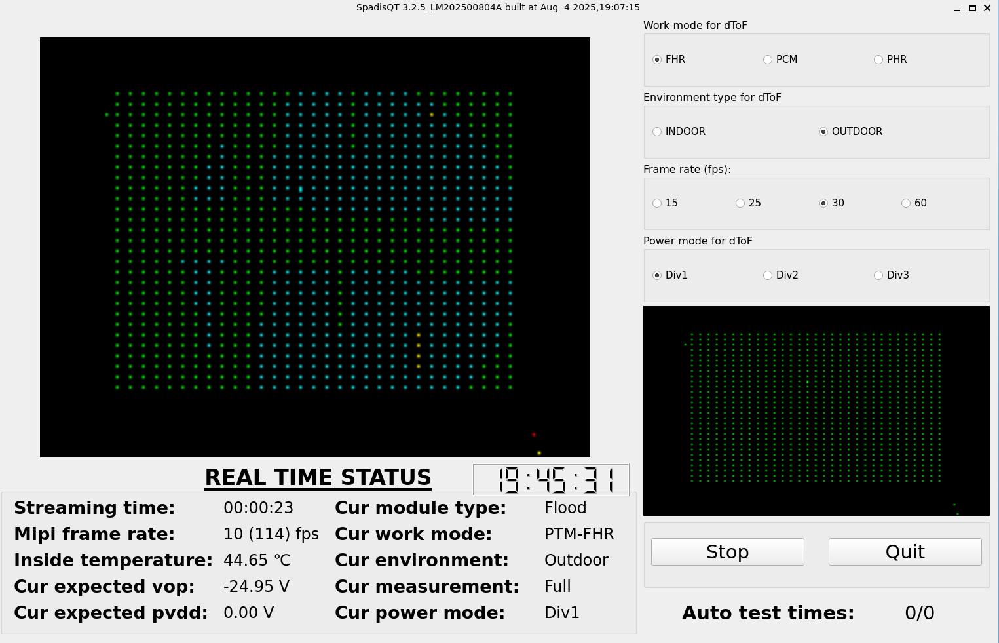
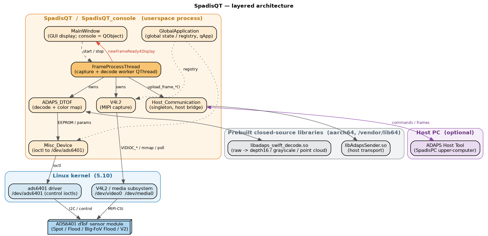
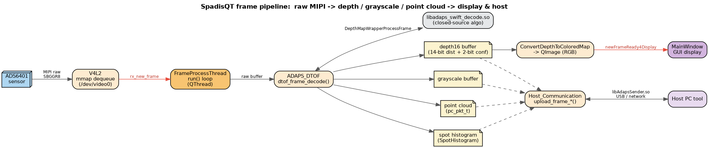
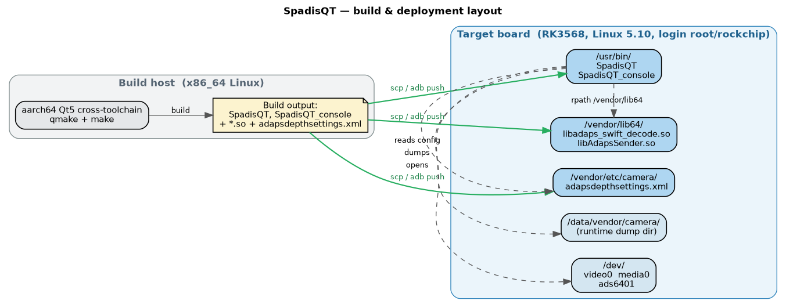

<div align="center">

# SpadisQT — ADAPS ADS6401 dToF 传感器参考应用

**一个运行于嵌入式 Linux 的 Qt 5 演示程序，用于采集、解码并可视化 ADAPS ADS6401 直接飞行时间（dToF）传感器的深度数据。**

[English](README.md) · [移植与开发指南](documents/SpadisQT_移植与开发指南.md) · [Porting Guide (EN)](documents/SpadisQT_Porting_Guide_EN.md)

[](https://opensource.org/licenses/LGPL-3.0)
[](#3-环境要求)
[](https://doc.qt.io/qt-5/)
[](#3-环境要求)

</div>

---

## 1. SpadisQT 是什么？

`SpadisQT` 是[深圳灵明光子（ADAPS Photonics）](https://adapsphotonics.com/) **ADS6401 dToF 传感器**的官方参考应用，运行于**嵌入式 Linux**，完整演示了从传感器到画面的整条数据链路：

1. 通过 **V4L2** 框架采集 Swift dToF 芯片的 MIPI 原始数据；
2. 经自研算法库 `libadaps_swift_decode.so` 解码为**深度 / 灰度 / 点云**数据；
3. 将深度信息渲染为 **RGB 彩色图**直观展示，并可选择将帧数据**上传至上位机工具**。

同一套代码可编译出两个版本：

| 目标 | Qt 模块 | 界面 | 适用场景 |
|------|---------|------|----------|
| **`SpadisQT`** | `core` + `gui` + `widgets` | 完整 GUI 窗口 | 带显示屏 / framebuffer 的开发板 |
| **`SpadisQT_console`** | 仅 `core` | 无界面（headless） | 无显示屏 / 由上位机驱动 / 管道场景 |

> ⚠️ 由于依赖 Linux **V4L2** API，SpadisQT **无法在 Windows 运行**。已在 **RK3568（Linux 5.10 内核）**上验证（代码同时内置了 RK3588 的设备节点路径）。

### 支持的 dToF 模块

ADS6401 芯片支持四种模块类型。执行 `ADAPS_GET_DTOF_MODULE_STATIC_DATA` ioctl 时，`ads6401` 内核驱动会返回当前模块类型：

- **散点（Spot）模块**
- **小面阵（Small-Flood）模块**
- **大 FoV 面阵（Big FoV Flood）模块**
- **大 FoV V2 面阵（Big FoV V2 Flood）模块**

### 运行截图

| GUI — 深度彩色图 | GUI — 运行画面 |
|---|---|
|  |  |

---

## 2. 软件架构

SpadisQT 是位于 `ads6401` 内核驱动与两个预编译 aarch64 库之上的一层轻量用户态程序。



| 组件 | 文件 | 职责 |
|------|------|------|
| `V4L2` | `v4l2.cpp/.h` | 传感器探测、V4L2 配置、mmap 缓冲队列、`poll()` 采集循环；发出 `rx_new_frame` 信号 |
| `FrameProcessThread` | `FrameProcessThread.cpp/.h` | 工作 `QThread`，持有 `V4L2` 与 `ADAPS_DTOF`，驱动解码并发出帧用于显示 / 上传 |
| `ADAPS_DTOF` | `adaps_dtof.cpp/.h` | 封装 `libadaps_swift_decode.so`：原始数据 → 深度16 / 灰度 / 点云，以及深度→RGB 配色 |
| `Misc_Device` | `misc_device.cpp/.h` | 对 `/dev/ads6401` 的全部 `ioctl`（EEPROM、曝光、寄存器、模块静态数据、配置脚本、ROI-SRAM） |
| `Host_Communication` | `host_comm.cpp/.h` | **单例**，经 `libAdapsSender.so` 与上位机通信（接收命令、上传帧） |
| `GlobalApplication` | `globalapplication.cpp/.h` | 全局状态 / 注册中心，通过重载的 `qApp` 宏访问 |
| `MainWindow` | `mainwindow.cpp/.h/.ui` | GUI 端接收解码后的帧；在 console 版本中退化为普通 `QObject` |

### 帧数据流



> **深度16（depth16）格式** —— 改进版 Android `DEPTH16`：低 **14 位**表示距离（将最大量程扩展至 **16.384 米**），高 **2 位**表示置信度（见 `adaps_dtof.h` 中的 `DEPTH_MASK` / `CONFIDENCE_MASK`）。

> 🧭 **想深入了解？** [开发者文档](docs/README.zh_CN.md) 另含线程模型、单帧时序图与完整 API 文档。所有图表均由 Graphviz 源文件经 [`tools/gen_diagrams.sh`](tools/gen_diagrams.sh) 生成。

---

## 3. 环境要求

**硬件**
- 一块通过 MIPI-CSI 连接 **ADS6401 dToF 模块**的嵌入式开发板（参考平台：RK3568、RK3588）；
- 开发板内核需包含 **`ads6401` 驱动**，并提供 `/dev/video0` + `/dev/media0`（V4L2）以及 `/dev/ads6401`（控制 ioctl）节点。

**软件**
- 目标架构的 **Qt 5.x**：交叉编译 SDK（推荐）或开发板上的本地 Qt 工具链。两个发布二进制均为 **aarch64**，且两个预编译库仅支持 aarch64，因此真正的目标构建需要**板端 aarch64 Qt sysroot**（apt 的宿主机 Qt5 无法链接它们）；
- 本仓库自带的两个预编译 aarch64 库：`libadaps_swift_decode.so`、`libAdapsSender.so`；
- 目标侧的 OpenSSL + zlib（`-lssl -lcrypto -lz`）；
- GUI 版本还需开发板具备可用的显示后端（X11、Wayland、EGLFS 或 LinuxFB）。

> ℹ️ 开始前请先确认开发板已支持 Qt 环境，该部分配置不在本项目范围内。
> 完整依赖列表，以及宿主机侧**编译验证**（无需 sysroot 即可在 x86_64 机器上校验源码可编译）见 [docs/build-environment.zh_CN.md](docs/build-environment.zh_CN.md)。

---

## 4. 快速上手

```bash
# 1. 编译（确保 aarch64 Qt5 交叉工具链已在 PATH 中）
qmake SpadisQT.pro            # GUI 目标
make -j"$(nproc)"
qmake SpadisQT_console.pro    # headless 目标
make -j"$(nproc)"

# 2. 在开发板上创建目标目录
mkdir -p /vendor/lib64 /vendor/etc/camera /data/vendor/camera

# 3. 部署（SSH 示例，也可用 `adb push`）
scp libadaps_swift_decode.so libAdapsSender.so  root@<开发板IP>:/vendor/lib64/
scp adapsdepthsettings.xml                      root@<开发板IP>:/vendor/etc/camera/
scp SpadisQT SpadisQT_console                   root@<开发板IP>:/usr/bin/

# 4. 在开发板上运行
chmod +x /usr/bin/SpadisQT /usr/bin/SpadisQT_console
SpadisQT                     # GUI（需要显示屏）
SpadisQT_console             # 无界面
```

📖 **第一次接触？** 完整的 **[移植与开发指南](documents/SpadisQT_移植与开发指南.md)** 从零讲解硬件确认、工具链搭建、配置、部署、调优与排错。

> 🧪 **还没有 sysroot？** 你仍可在普通 x86_64 Linux 宿主机上校验源码能否编译（`sudo apt-get install -y qtbase5-dev qtbase5-dev-tools libssl-dev zlib1g-dev`，然后 `qmake` + `make`）。最终链接会因 aarch64 `.so` 而失败——这是预期内的。详见 [docs/build-environment.zh_CN.md](docs/build-environment.zh_CN.md)。

---

## 5. 部署布局



| 开发板路径 | 内容 |
|------------|------|
| `/usr/bin/SpadisQT`、`/usr/bin/SpadisQT_console` | 两个可执行文件 |
| `/vendor/lib64/libadaps_swift_decode.so`、`libAdapsSender.so` | 算法库 + 上位机传输库（程序以 `-rpath /vendor/lib64` 链接） |
| `/vendor/etc/camera/adapsdepthsettings.xml` | 算法配置 —— **必须与你的 SoC 匹配**（见下） |
| `/data/vendor/camera/` | 运行期数据转储目录（被 `dump`/`save` 类环境变量使用） |

> 🔧 **按 SoC 区分的配置项。** `adapsdepthsettings.xml` 中的 `BufferWidthPHR` / `BufferWidthFHR` 与平台相关。**RK3568 / RK3588** 应分别设为 `1280` / `4352`。文件中也列出了 SM8450/SM8250/SM8550/海思 的取值 —— 移植到新 SoC 前务必先设置正确。

---

## 6. 配置与调优

- **编译期开关**（在 `.pro` 中设置）用于门控整个子系统：`RUN_ON_EMBEDDED_LINUX`、`RUN_ON_RK3568`（对 RK3588 选用不同设备节点）、`CONSOLE_APP_WITHOUT_GUI`、`STANDALONE_APP_WITHOUT_HOST_COMMUNICATION`、`ENABLE_POINTCLOUD_OUTPUT`、`ENABLE_COMPATIABLE_WITH_OLD_ALGO_LIB`。
- **运行期环境变量**（定义于 `common.h`，以 `ENV_VAR_*` 为前缀）用于开关数据转储、文件回放、镜像、强制参数与详细日志 —— 例如 `debug_info_enable=true`、`save_frame_raw_data_enable=true`、`mirror_x_enable=true`、`raw_file_replay_enable=true`、`force_framerate_fps=30`。

完整对照表见移植与开发指南。

---

## 7. 文档

**开发者参考**（代码内部细节）—— [`docs/`](docs/README.zh_CN.md)：

- **[软件架构](docs/architecture.zh_CN.md)** —— 分层设计、核心类、线程模型、编译期开关。
- **[数据流程](docs/data-flow.zh_CN.md)** —— 帧处理流水线、depth16 格式、工作模式。
- **[API 文档](docs/api-reference.zh_CN.md)** —— 各类 API、解码库与上位机协议契约、环境变量开关。
- **[构建环境](docs/build-environment.zh_CN.md)** —— 依赖、交叉构建、宿主机编译验证。

**集成指南**（把它跑到板子上）：

- **[移植与开发指南（中文）](documents/SpadisQT_移植与开发指南.md)** —— 面向首次集成者的完整实操文档。
- **[Porting & Development Guide (English)](documents/SpadisQT_Porting_Guide_EN.md)** —— 英文完整移植开发文档。
- **[Ads6401 dToF SDK for Linux 用户手册（PDF）](documents/Ads6401_dToF_SDK_For_Linux_User_Guide.pdf)** —— SDK 参考手册。

> 本仓库所有图表均由 [`tools/diagrams/`](tools/diagrams/) 中的 Graphviz 源文件经 [`tools/gen_diagrams.sh`](tools/gen_diagrams.sh) 生成——请修改 `.dot` 而非图片。

---

## 8. 支持与许可证

技术问题请联系 **[深圳灵明光子（ADAPS Photonics）](https://adapsphotonics.com/)**。

SpadisQT 遵循 **[GNU LGPLv3](https://opensource.org/licenses/LGPL-3.0)** 协议，并以 **[Qt LGPL](https://doc.qt.io/archives/qt-5.15/lgpl.html)** 使用 Qt。
