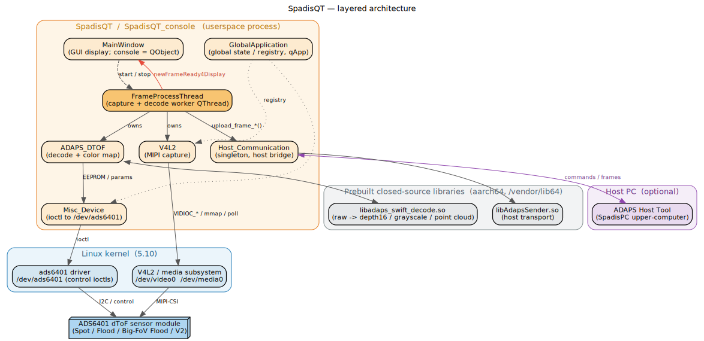
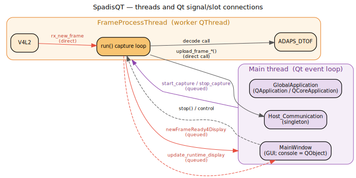

# SpadisQT — Architecture

[简体中文](architecture.zh_CN.md) · [Docs index](README.md)

SpadisQT is a **userspace Qt 5 application** that turns raw MIPI frames from the ADAPS
ADS6401 dToF sensor into depth / grayscale / point-cloud data, visualizes them, and
optionally streams them to a host PC. It is a thin layer over the `ads6401` kernel driver
and two prebuilt, closed-source aarch64 libraries.

## 1. Layers

From the bottom up:

1. **Hardware** — the ADS6401 dToF sensor module (one of four types: *Spot*, *Flood*,
   *Big-FoV Flood*, *Big-FoV Flood V2*), connected over MIPI-CSI plus an I²C/control bus.
2. **Linux kernel** — the V4L2/media subsystem exposes `/dev/video0` + `/dev/media0` for
   streaming; the `ads6401` driver exposes `/dev/ads6401` for control ioctls (EEPROM,
   exposure, registers, module static data, config-script & ROI-SRAM upload).
3. **Prebuilt libraries** (`/vendor/lib64`) — `libadaps_swift_decode.so` (the decode
   algorithm) and `libAdapsSender.so` (host transport). Both are aarch64-only blobs; the
   app links them via `-Wl,-rpath,/vendor/lib64/`.
4. **Application process** — `SpadisQT` (GUI) or `SpadisQT_console` (headless), built from
   the same sources.
5. **Host PC (optional)** — the ADAPS upper-computer tool, reached through `libAdapsSender.so`.

## 2. Core classes

| Class | File | Responsibility |
|-------|------|----------------|
| `V4L2` | `v4l2.cpp/.h` | Owns the V4L2 device: sub-device discovery by name keyword `ads6401`, `VIDIOC_*` setup, buffer mmap/queue, the `poll()` capture loop, frame dequeue. Emits `rx_new_frame` / `update_info`. |
| `FrameProcessThread` | `FrameProcessThread.cpp/.h` | The worker `QThread`. Constructs and owns `V4L2` + `ADAPS_DTOF`, wires their signals, runs the capture loop in `run()`, decodes each frame, emits frames for display and/or upload. |
| `ADAPS_DTOF` | `adaps_dtof.cpp/.h` | Wraps the decode library via `depthmapwrapper.h`. Turns raw data into depth16 / grayscale / point cloud, applies the color map (`ConvertDepthToColoredMap`), produces histograms. |
| `Misc_Device` | `misc_device.cpp/.h` | All ioctl traffic to `/dev/ads6401`: EEPROM/calibration read, exposure params, register R/W, module static data, config-script + ROI-SRAM upload. |
| `Host_Communication` | `host_comm.cpp/.h` | **Singleton** bridge to the host PC over `libAdapsSender.so`. Receives commands and uploads raw/depth16/point-cloud/histogram frames. |
| `GlobalApplication` | `globalapplication.cpp/.h` | `QApplication`/`QCoreApplication` subclass reached via the overridden `qApp` macro. The **global state holder / registry**: selected sensor type & work mode, color-map ranges, loaded calibration buffers, and the singleton `V4L2`/`Misc_Device` pointers. |
| `MainWindow` | `mainwindow.cpp/.h/.ui` | GUI receiver of decoded frames and status. In console builds it degrades to a plain `QObject` with the GUI slots compiled out. |

`main.cpp` enforces single-instance startup via `QLockFile`, installs Unix signal handlers
(with a `backtrace()` crash dump), runs `requirement_check()` (the algo `.so` and the XML
config must exist), then starts the app.

## 3. Threading model

There are two threads:

- **Main thread** — runs the Qt event loop; hosts `GlobalApplication`, `MainWindow`
  (GUI only) and the `Host_Communication` singleton.
- **`FrameProcessThread`** — the capture+decode worker. It owns `V4L2` and `ADAPS_DTOF`,
  which live in the worker thread's affinity.

Signals cross the threads:

- `V4L2::rx_new_frame` → `FrameProcessThread::new_frame_handle` runs **inside the worker
  thread** (the heavy decode path).
- `FrameProcessThread::newFrameReady4Display` / `update_runtime_display` are delivered to
  `MainWindow` on the **main thread** (queued connection) so GUI updates stay thread-safe.
- `Host_Communication::start_capture` / `stop_capture` come from the host transport's
  callback and are delivered to the worker thread.
- Frame uploads (`upload_frame_*`) are called **directly** from the worker thread into the
  `Host_Communication` singleton.

See [Data Flow](data-flow.md) for the per-frame sequence.

## 4. Compile-time feature switches

Whole subsystems are gated by `DEFINES` set in the two `.pro` files. **When you edit a
signal/slot that is `#if`-branched on one of these, change every branch.**

| Define | Effect |
|--------|--------|
| `RUN_ON_EMBEDDED_LINUX` | Master switch — compiles in `adaps_dtof.cpp`, `host_comm.cpp`, `misc_device.cpp` and links the two algo `.so`s. Without it only the V4L2/RGB skeleton builds. |
| `RUN_ON_RK3568` vs else | Selects device nodes: `/dev/media0` + `/dev/video0` (RK3568) vs `/dev/media2` + `/dev/video22` (RK3588), in `common.h`. |
| `CONSOLE_APP_WITHOUT_GUI` | Headless build — `MainWindow` becomes a `QObject`; all GUI/`QImage` paths are compiled out. Set only by `SpadisQT_console.pro`. |
| `STANDALONE_APP_WITHOUT_HOST_COMMUNICATION` | Drops `Host_Communication` entirely. Note `rx_new_frame` / `new_frame_handle` have **two signatures** depending on this flag. |
| `ENABLE_POINTCLOUD_OUTPUT` | Enables point-cloud output (also gated on algo-lib version ≥ 3.5.6). |
| `ENABLE_COMPATIABLE_WITH_OLD_ALGO_LIB` | Back-compat shim for the older `libadaps_swift_decode_3.3.2.so`. |

The two `.pro` files build the **same sources** and differ only by the `gui`/`widgets` vs
`core`-only Qt modules and the `CONSOLE_APP_WITHOUT_GUI` define — keep them in sync when
adding sources.

## 5. Versioning contract

Two version triples must stay aligned (see [API Reference §6](api-reference.md#6-versioning)):

- **App version** — `VERSION_MAJOR/MINOR/REVISION` + `LAST_MODIFIED_TIME` in `common.h`
  (git commits are tagged like `v3.6.9_LM20260605A`).
- **Algo-lib version** — `ALGO_LIB_VERSION_MAJOR/MINOR/REVISION` in `depthmapwrapper.h`.
  Feature code is `#if`-guarded against `ALGO_LIB_VERSION_CODE` at thresholds 3.5.6 / 3.6.2
  / 3.6.5. **When swapping `libadaps_swift_decode.so`, bump these macros to match**, or the
  version-gated fields won't line up with the binary.
