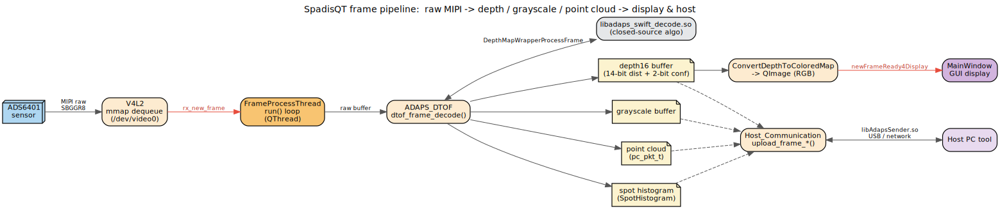
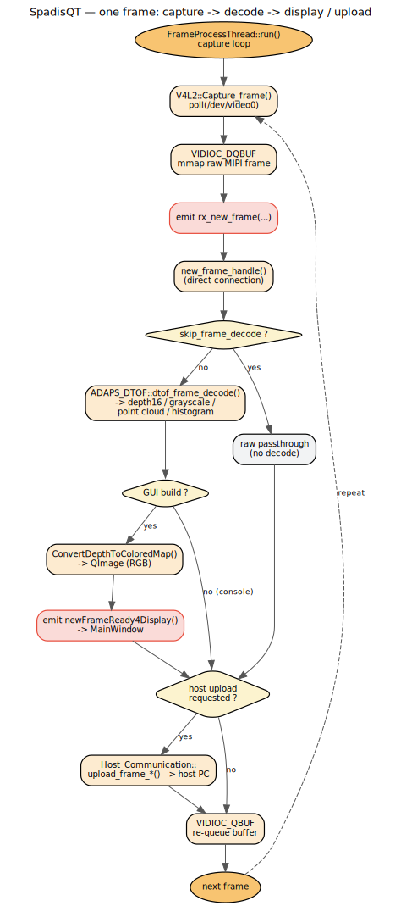

# SpadisQT — Data Flow

[简体中文](data-flow.zh_CN.md) · [Docs index](README.md)

This document traces a frame from the sensor to the screen / host, describes the depth16
format and the work modes, and shows the per-frame control flow.

## 1. The frame pipeline

1. The **ADS6401 sensor** streams raw MIPI data (`V4L2_PIX_FMT_SBGGR8`).
2. **`V4L2`** dequeues mmap'd buffers from `/dev/video0` in its `poll()` loop and emits
   `rx_new_frame(...)`.
3. **`FrameProcessThread`** receives the frame in `new_frame_handle()` and calls
   `ADAPS_DTOF::dtof_frame_decode()`.
4. **`ADAPS_DTOF`** invokes the closed-source `DepthMapWrapperProcessFrame()` and produces,
   depending on the work mode and build options:
   - a **depth16** buffer,
   - a **grayscale** buffer,
   - a **point cloud** (`pc_pkt_t` array), and/or
   - **spot histograms** (`SpotHistogram`).
5. For GUI builds, depth16 is colorized via `ConvertDepthToColoredMap()` into a `QImage`
   and emitted as `newFrameReady4Display()` to **`MainWindow`**.
6. If the host requested output, the decoded buffers are pushed through
   **`Host_Communication::upload_frame_*()`** over `libAdapsSender.so`.

## 2. Per-frame control flow

The worker loop in `FrameProcessThread::run()` repeatedly:

1. `V4L2::Capture_frame()` → `poll()` on the video fd, then `VIDIOC_DQBUF` to get the raw
   buffer.
2. Emits `rx_new_frame`, handled (same thread) by `new_frame_handle()`.
3. **Decode branch** — unless `skip_frame_decode` is set, calls `dtof_frame_decode()`.
4. **Display branch** — GUI builds colorize depth16 and emit `newFrameReady4Display`.
5. **Upload branch** — when the host requested capture, calls `upload_frame_*()`.
6. `VIDIOC_QBUF` re-queues the buffer; loop continues.

Many steps are switchable at runtime via env vars (see
[API Reference §7](api-reference.md#7-runtime-environment-variables)) — e.g. `skip_frame_decode`,
`save_frame_raw_data_enable`, `raw_file_replay_enable`, `force_framerate_fps`.

## 3. The depth16 format

The output is a **modified Android `DEPTH16`** (`adaps_dtof.h`):

- Standard Android DEPTH16 packs confidence in the top 3 bits and distance in the low 13.
- SpadisQT instead uses the **low 14 bits for distance** (`DEPTH_MASK = 0x3FFF`,
  `DEPTH_BITS = 14`) — extending the max range from 8.192 m to **16.384 m** — and the
  **high 2 bits for confidence** (`CONFIDENCE_MASK = 0x3`).

Confidence levels (`enum depth_confidence_level`): `ANDROID_CONF_HIGH = 0`,
`ANDROID_CONF_LOW = 1`, `ANDROID_CONF_MEDIUM = 3`.

Color mapping uses `RANGE_MIN = 30` mm .. `RANGE_MAX = 8192` mm by default; the live range
is adjustable via `GlobalApplication`'s color-map setters (and the host
`SET_COLORMAP_RANGE_PARAM` command). The output resolution is **210 × 160**
(`OUTPUT_WIDTH/HEIGHT_4_DTOF_SENSOR`).

## 4. Sensor types and work modes

`enum sensortype` (`common.h`): `SENSOR_TYPE_RGB`, `SENSOR_TYPE_DTOF`.

`enum sensor_workmode` (`common.h`):

| Work mode | Meaning |
|-----------|---------|
| `WK_DTOF_PHR` | dToF partial/high-rate depth capture |
| `WK_DTOF_PCM` | dToF point-cloud mode |
| `WK_DTOF_FHR` | dToF full histogram-rate mode |
| `WK_RGB_NV12` / `WK_RGB_YUYV` | RGB sensor passthrough modes |

`enum frame_data_type` distinguishes the buffers flowing through the pipeline
(`FDATA_TYPE_DTOF_RAW_*`, `FDATA_TYPE_DTOF_DECODED_DEPTH16`,
`FDATA_TYPE_DTOF_DECODED_POINT_CLOUD`, `FDATA_TYPE_DTOF_RAW_HISTOGRAM`, the RGB types, …).

## 5. Buffering & timing constants (`v4l2.h` / `common.h`)

- `BUFFER_COUNT_4_DTOF_SENSOR = 12` mmap buffers (overridable via `force_frame_buffer_count`).
- `MIPI_RAW_HEIGHT_4_DTOF_SENSOR = 32` raw MIPI lines per transfer.
- `FRAME_PROCESS_THREAD_INTERVAL_US = 10` µs loop pacing.
- `DEFAULT_POLL_TIMEOUT_MS = -1` (wait forever; overridable via `force_poll_timeout`).
- Temperature is read every `FRAME_COUNT_TO_READ_TEMPERATURE = 10` frames; warnings fire
  outside `CHIP_TEMPERATURE_MIN/MAX_THRESHOLD` (15 °C .. 90 °C).
